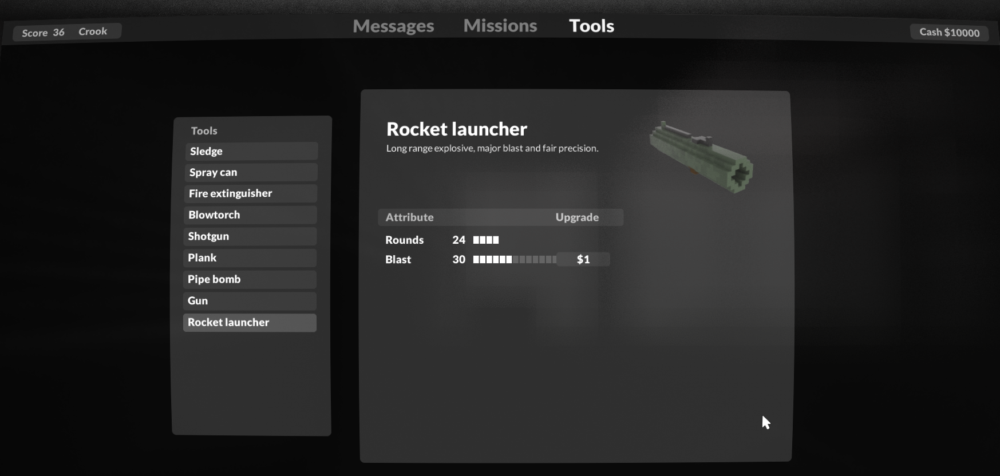

# Teardown Mini Nuke Mod

Unlock Teardown's maximum blast range limit and turn the rocket launcher into a mini nuke launcher.

## Usage

- Place `teardown_modded.exe` in the game's directory
- Replace the game's `data/game.lua` with the file of the same name from this mod
- Replace your save file (`C:\Users\[USERNAME]\Documents\Teardown\savegame.xml`) with the file from this mod
- Launch the game with `teardown_modded.exe`, play Campaign and check your computer :)

